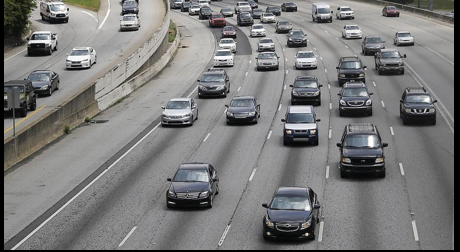
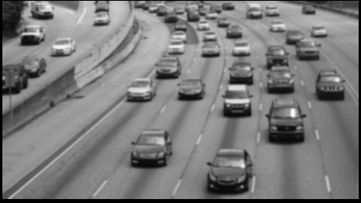
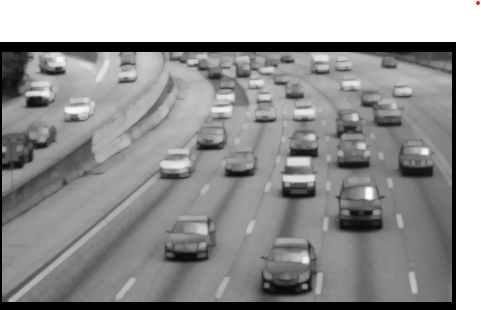
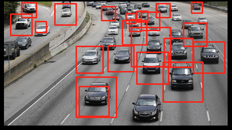

# Vehicle Detect Project

This project demonstrates a simple method to detect vehicles in an image using Python and OpenCV. The project is designed for beginners who are learning about image processing and computer vision.

## Importing Libraries

We need to import several libraries to handle images and perform the necessary operations.

```python
from PIL import Image
import cv2
import numpy as np
import requests
from io import BytesIO
```

## Reading Image from Drive

First, we read the image from our drive, resize it for better processing, and convert it to a NumPy array.

```python
img = Image.open('/content/drive/MyDrive/veh-detect-project-resources/cars.png')
img = img.resize((450, 250))
img_arr = np.array(img)
img
```



## Converting Image to Grayscale

To get better results, we convert the image to grayscale.

```python
grey = cv2.cvtColor(img_arr, cv2.COLOR_BGR2GRAY)
Image.fromarray(grey)
```



## Applying Gaussian Blur

The grayscale image has a lot of noise, making it hard to identify cars. We apply Gaussian blur to reduce the noise.

```python
blur = cv2.GaussianBlur(grey, (5,5), 0)
Image.fromarray(blur)
```


## Dilating the Image

Dilating the image helps to make the cars more visible by expanding the white areas.

```python
dilated = cv2.dilate(blur, np.ones((3,3)))
Image.fromarray(dilated)
```



## Morphology Transformation

We use a kernel to perform a morphological transformation to clean up the image further.

```python
kernel = cv2.getStructuringElement(cv2.MORPH_ELLIPSE, (2,2))
closing = cv2.morphologyEx(dilated, cv2.MORPH_CLOSE, kernel)
Image.fromarray(closing)
```



## Conclusion

This simple project demonstrates the steps to preprocess an image for vehicle detection using OpenCV. The main steps include converting the image to grayscale, applying Gaussian blur, dilating the image, and performing morphological transformations. These preprocessing steps help to enhance the features of the vehicles, making them easier to detect.
